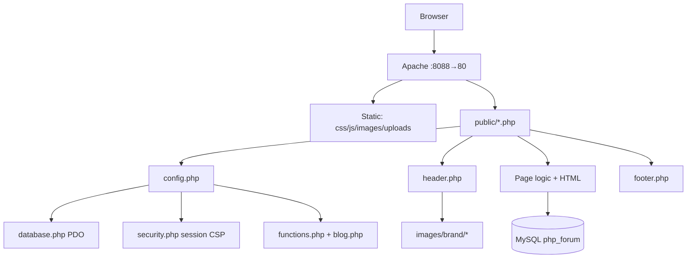
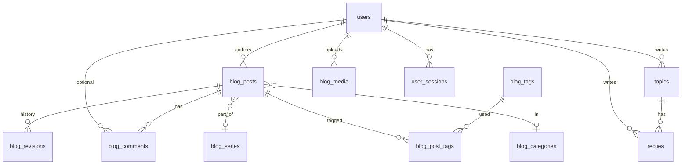

<p align="center">
  
</p>

<h1 align="center">Athesis</h1>

<p align="center">
  <strong>Forum + professional blog</strong> · pure black · JetBrains Mono · chatak red<br/>
  <em>Sparse discussions. Long-form when it matters.</em>
</p>

<p align="center">
  
</p>

<p align="center">
  <code>SITE_NAME = Athesis</code> · repo <code>anubhavg-icpl/athesis</code> · not “PHP Forum”
</p>

---

## Preview

| Home hero | Brand mark | Blog cover | Empty / void |
|-----------|------------|------------|--------------|
|  |  |  |  |

| Acrisione (project mark) |
|--------------------------|
|  |

UI tokens match the art: **OLED `#000`**, text **`#f2eeea`**, accent **`#ff0033`**.

---

## Implementation architecture


### Request flow




### Data model




---

## Stack

| Layer | Choice |
|--------|--------|
| Runtime | PHP 8.2 + Apache (`Dockerfile`) |
| Database | MySQL 8 (Docker service `db`) |
| UI | Bootstrap 5 **grid only** + full Odyssey restyle in `public/css/style.css` |
| Type | JetBrains Mono |
| Design | Black mono · chatak red · 720px wrap · 56px nav |
| Compose | `docker-compose.yml` → **http://localhost:8088** |

---

## What ships (end-to-end)

### Forum
| Feature | Path |
|---------|------|
| Home | `public/index.php` |
| Topics / search / sort | `public/forum/topics.php` |
| View + replies | `public/forum/view_topic.php` |
| Create / edit topic | `create_topic.php`, `edit_topic.php` |
| Edit reply | `edit_reply.php` |
| Auth | `public/auth/*` |
| Public signatures | profile + under posts |

### Blog (phases 1–4)
| Feature | Path |
|---------|------|
| Index / search / tags | `public/blog/index.php` |
| Single post (TOC, share, paywall, series) | `post.php` |
| Write / schedule / preview / revisions | `write.php` |
| Admin + bulk actions | `admin.php` |
| Media library | `media.php` |
| Moderate comments | `moderate.php` |
| Archive · series · RSS · sitemap | `archive.php`, `series.php`, `rss.php`, `sitemap.php` |
| Subscribers | `subscribers.php` |

### Site
| Feature | Path |
|---------|------|
| About · privacy · contact | `public/pages/*` |
| 404 | `public/404.php` |
| Brand art | `public/images/brand/` + `Athesis_acrisione.jpg` |
| Pretty URLs | `.htaccess` → `/blog/post/{slug}` |

---

## Quick start (Docker)

```bash
git clone https://github.com/anubhavg-icpl/athesis.git
cd athesis
docker compose up -d --build
```

**App:** [http://localhost:8088/public/index.php](http://localhost:8088/public/index.php)

### Migrations (existing DB volumes)

```bash
docker exec -i athesis-db-1 mysql -uforum -pforumpass php_forum < sql/migration_add_signature.sql
docker exec -i athesis-db-1 mysql -uforum -pforumpass php_forum < sql/migration_blog_phase1.sql
docker exec -i athesis-db-1 mysql -uforum -pforumpass php_forum < sql/migration_blog_phase2.sql
docker exec -i athesis-db-1 mysql -uforum -pforumpass php_forum < sql/migration_blog_phase3_4.sql
```

Ignore “duplicate column / already exists” if already applied.

### Default admin

| | |
|--|--|
| User | `admin` |
| Pass | `admin123` |

Change immediately.

---

## Project structure

```
athesis/
├── Athesis_acrisione.jpg      # Project / species mark (README hero)
├── docs/assets/               # README diagrams + brand mirrors
│   ├── architecture.svg
│   ├── request-flow.svg
│   ├── data-model.svg
│   ├── athesis-acrisione.jpg
│   ├── hero-banner.jpg
│   ├── mark-red.jpg
│   ├── blog-cover.jpg
│   └── empty-void.jpg
├── config/
│   ├── config.php             # SITE_NAME=Athesis, pagination, analytics env
│   ├── database.php           # PDO (env-overridable)
│   └── security.php           # headers, CSP, sessions, rate limit
├── includes/
│   ├── functions.php          # auth, CSRF, sanitize, roles, member
│   ├── blog.php               # slugs, TOC, code HL, media, schedule
│   ├── header.php / footer.php
│   └── partials/newsletter.php
├── public/
│   ├── index.php              # Home (aligned hero + mark)
│   ├── auth/  forum/  blog/  pages/
│   ├── images/brand/          # Runtime brand art + favicon
│   ├── uploads/blog/          # Media uploads
│   ├── css/style.css          # Design system
│   └── js/script.js
├── sql/
│   ├── forum_setup.sql
│   └── migration_*.sql
├── docker/ · Dockerfile · docker-compose.yml
└── README.md
```

---

## Design system

```css
:root {
  --bg: #000000;
  --text: #f2eeea;
  --accent: #ff0033; /* chatak laal */
  --font: "JetBrains Mono", ui-monospace, monospace;
  --wrap: 720px;
  --nav-h: 56px;
}
```

| Asset | Role |
|--------|------|
| `Athesis_acrisione.jpg` / `docs/assets/athesis-acrisione.jpg` | Product identity (Acrisione butterfly) |
| `mark-red.jpg` | Nav + intro mark |
| `hero-banner.jpg` | Home banner (`$_` glow) |
| `blog-cover.jpg` | Blog / default post cover |
| `empty-void.jpg` | Empty states + 404 |
| `favicon.png` | Browser icon |

---

## Module map

| Module | Responsibility |
|--------|----------------|
| **Auth** | Register, login, logout, profile, signatures, membership flag |
| **Forum** | Topics, replies, search, pin/lock markers, full-row links |
| **Blog** | CMS lifecycle: draft → schedule → publish → revise |
| **Editorial** | Admin bulk ops, media upload, comment moderation |
| **Growth** | Newsletter, share, archive, series, TOC, code style |
| **Scale** | Paywall, roles, analytics hooks, pretty URLs, legal pages |
| **Chrome** | Odyssey layout, brand images, flash messages, footer motto |

---

## Configuration

| Key | Location |
|-----|----------|
| `SITE_NAME` | `config/config.php` → **Athesis** |
| DB | `DB_HOST` `DB_NAME` `DB_USER` `DB_PASS` env |
| Uploads | `MAX_UPLOAD_SIZE`, `public/uploads/blog/` |
| Analytics | `PLAUSIBLE_DOMAIN`, `GA_MEASUREMENT_ID` |
| Debug | `APP_DEBUG=1` |

---

## Security

- bcrypt passwords · CSRF tokens · prepared statements  
- XSS sanitization · limited HTML on content  
- CSP + security headers · upload MIME allowlist  
- PHP execution blocked under uploads  

Production: HTTPS, rotate admin, backups, least-privilege DB user.

---

## Local without Docker

1. PHP 8.2+, MySQL 8  
2. Import `sql/forum_setup.sql` + migrations  
3. Point docroot at **repo root** so `/public/...` works  
4. `chmod` `public/uploads/blog` writable  

---

## Useful URLs

| URL | Page |
|-----|------|
| `/public/index.php` | Home |
| `/public/forum/topics.php` | Forum |
| `/public/blog/index.php` | Blog |
| `/public/blog/write.php` | Write |
| `/public/blog/admin.php` | Admin |
| `/public/pages/about.php` | About |
| `/blog/post/{slug}` | Pretty post |

---

<p align="center">
  
  <br/>
  <strong>Athesis</strong> · sparse discussions · long-form when it matters<br/>
  <sub>can’t stop · won’t stop</sub>
</p>
