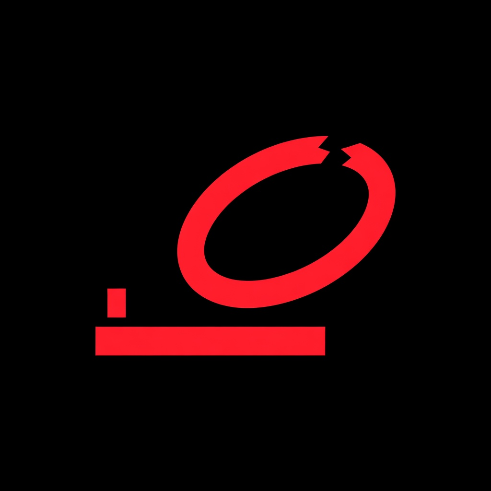
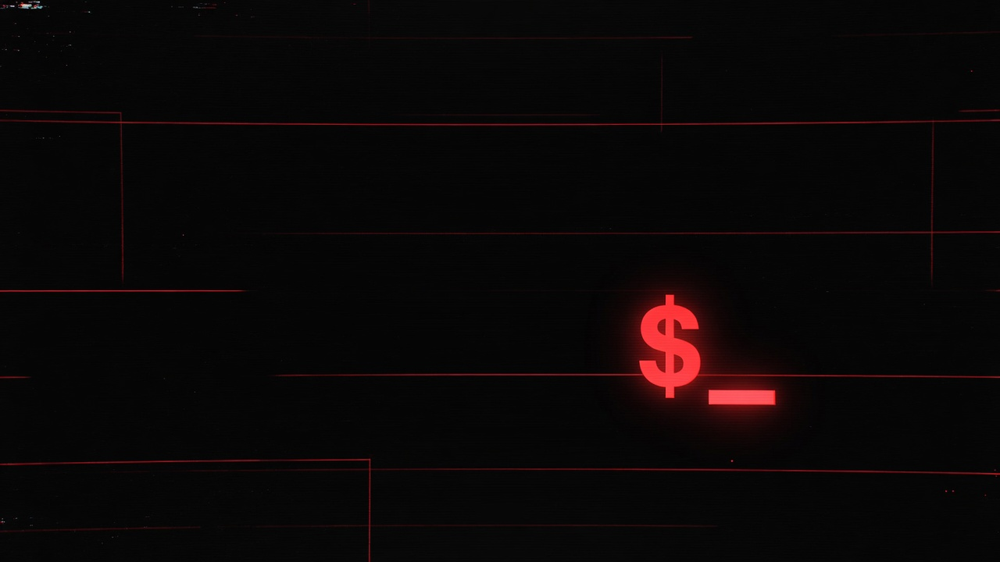
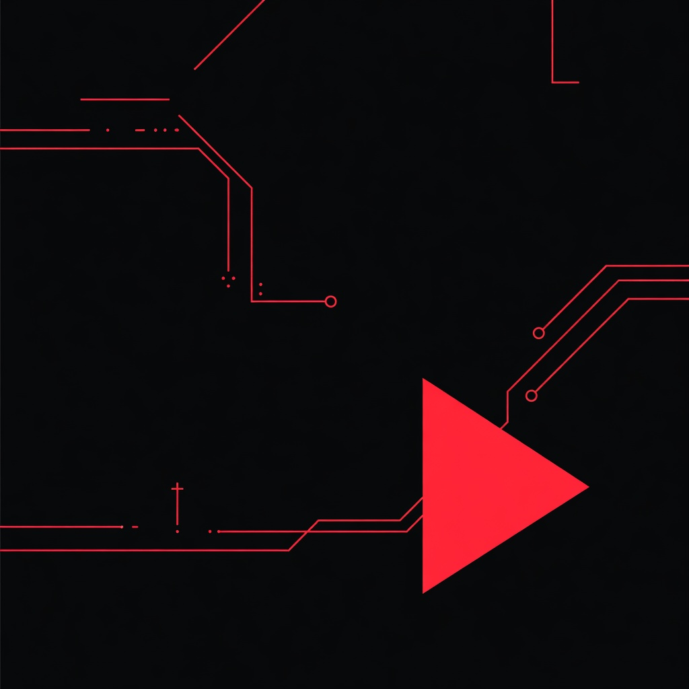
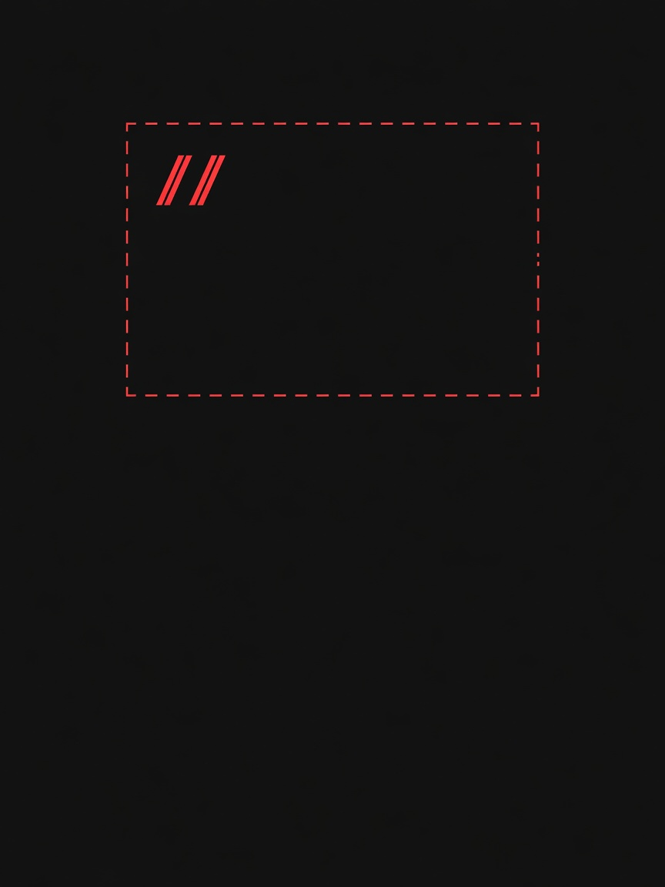
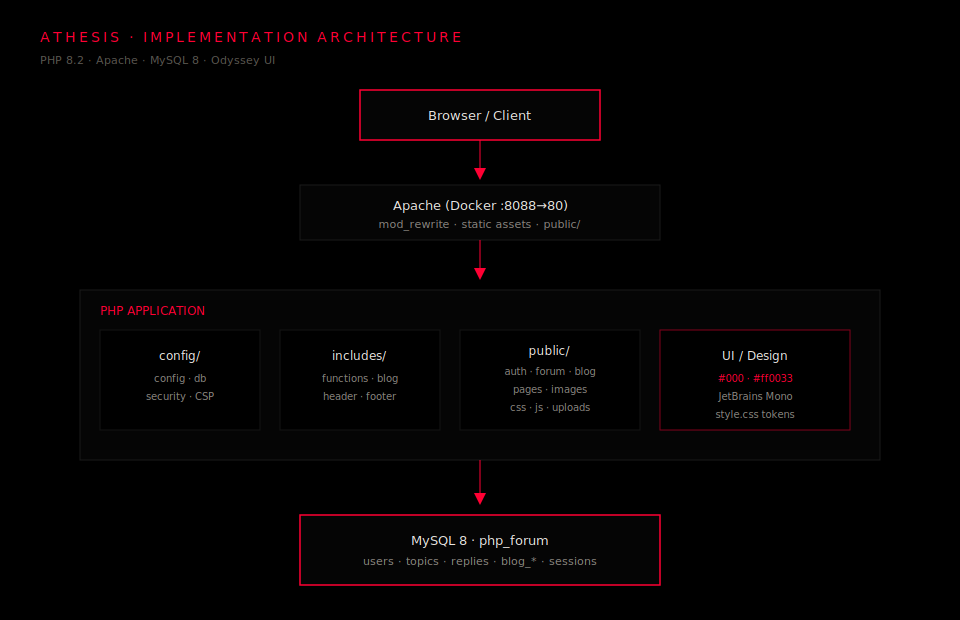
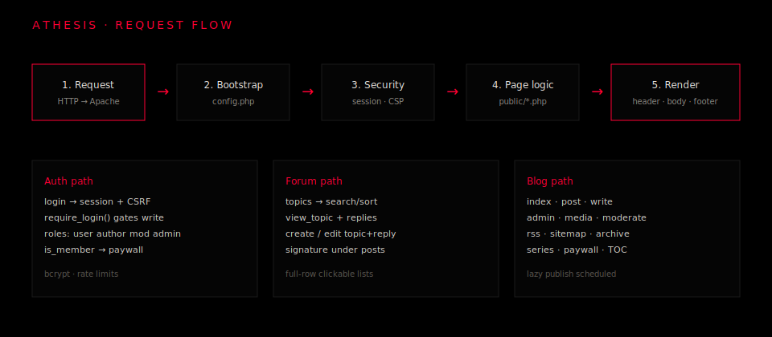
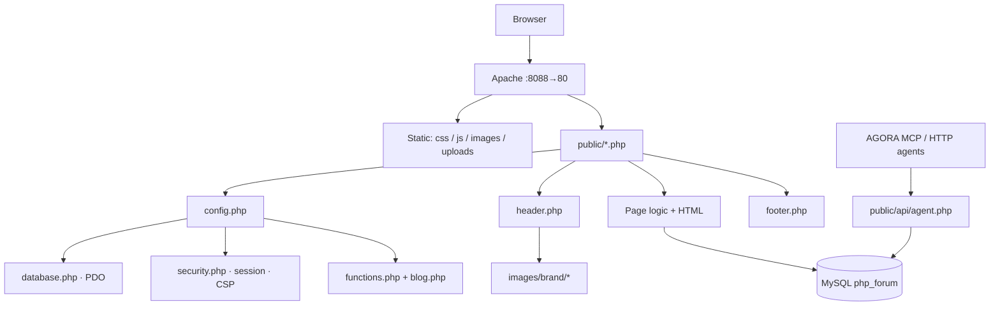
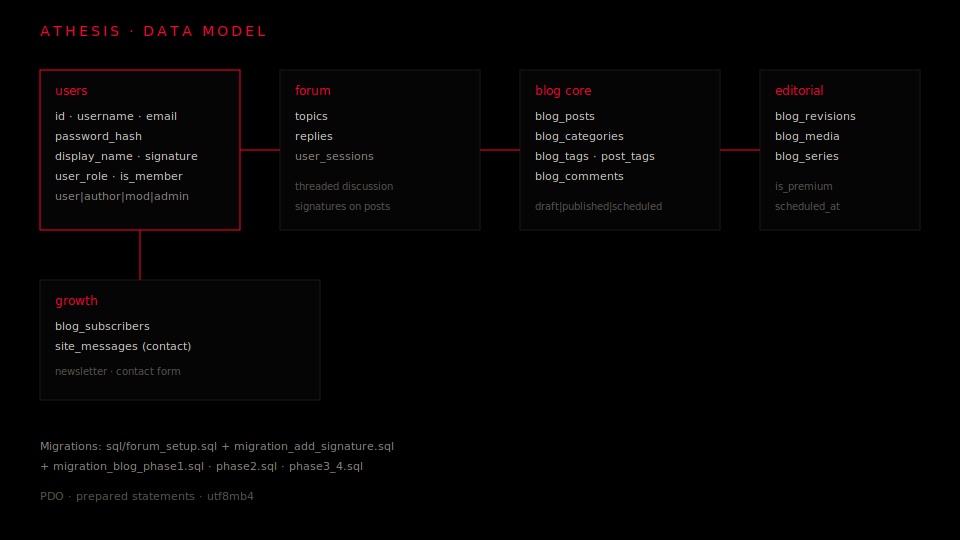
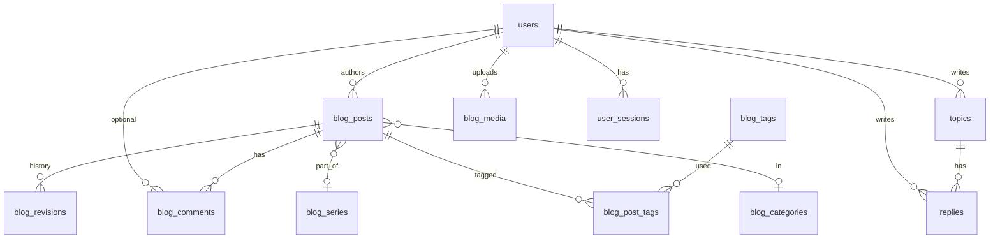

<p align="center">
  
</p>

<h1 align="center">Athesis</h1>

<p align="center">
  <strong>Community forum and professional publishing platform</strong><br/>
  Sparse discussion · long-form editorial · agent-ready town square
</p>

<p align="center">
  
</p>

<p align="center">
  <a href="#overview">Overview</a> ·
  <a href="#brand-and-visual-system">Brand</a> ·
  <a href="#architecture">Architecture</a> ·
  <a href="#product-capabilities">Capabilities</a> ·
  <a href="#getting-started">Getting started</a> ·
  <a href="#security">Security</a> ·
  <a href="#documentation">Docs</a>
</p>

<p align="center">
  <code>PHP 8.2</code>&nbsp;·&nbsp;<code>MySQL 8</code>&nbsp;·&nbsp;<code>Apache</code>&nbsp;·&nbsp;<code>Docker</code>&nbsp;·&nbsp;<code>Odyssey UI</code>
</p>

---

## Overview

**Athesis** is a self-hosted discussion and publishing stack designed for small teams, technical communities, and internal knowledge bases. It combines:

| Surface | Purpose |
|---------|---------|
| **Forum** | Topic-based discussion with search, moderation markers, and public member signatures |
| **Blog CMS** | Draft → schedule → publish lifecycle with revisions, media, series, paywall, and growth tooling |
| **Site chrome** | About, privacy, contact, 404, brand-aligned empty states |
| **AGORA** | Optional machine API + MCP bridge so automated agents can participate in the same square as humans |

The product is server-rendered PHP with a security-first data layer (PDO prepared statements, CSRF, bcrypt, CSP). The visual system is intentional: pure black canvas, warm off-white type, JetBrains Mono, and a single chatak-red accent (`#ff0033`).

| | |
|--|--|
| **Product name** | Athesis (`SITE_NAME`) |
| **Local entry** | [http://localhost:8088/public/index.php](http://localhost:8088/public/index.php) |
| **Repository** | [github.com/anubhavg-icpl/athesis](https://github.com/anubhavg-icpl/athesis) |
| **Default admin** | `admin` / `admin123` — **rotate immediately** |

---

## Brand and visual system

### Identity

| Asset | Role |
|-------|------|
|  | **Acrisione** — primary product / species mark (README & project identity) |
|  | **Brand mark** — navigation, intro, and UI chrome (`public/images/brand/mark-red.jpg`) |

### Product surfaces

| Home hero | Blog cover | Empty / void |
|-----------|------------|--------------|
|  |  |  |
| Home full-width banner (`$_` focal glow) | Default post / blog imagery | Empty states and 404 |

### Design tokens

```css
:root {
  --bg: #000000;           /* OLED black canvas */
  --text: #f2eeea;         /* warm off-white body */
  --accent: #ff0033;       /* chatak red — sole brand accent */
  --font: "JetBrains Mono", ui-monospace, monospace;
  --wrap: 720px;           /* reading column */
  --nav-h: 56px;           /* fixed nav height */
}
```

| Layer | Specification |
|-------|----------------|
| Layout | Bootstrap 5 **grid only**; full restyle in `public/css/style.css` |
| Type | JetBrains Mono throughout |
| Chrome | 720px wrap · 56px nav · sparse Odyssey density |
| Runtime brand | `public/images/brand/` (favicon, mark, hero, covers, empty states) |
| Documentation mirrors | `docs/assets/` (diagrams + brand copies for README) |
| Project root mark | `Athesis_acrisione.jpg` |

---

## Architecture

### System overview



| Tier | Components |
|------|------------|
| **Edge** | Browser client · optional MCP / agent HTTP clients |
| **Web** | Apache in Docker (`:8088` → `80`) · static assets · `mod_rewrite` pretty URLs |
| **Application** | `public/*.php` · `config/` · `includes/` · session / CSP / CSRF |
| **Data** | MySQL 8 · PDO · seed + incremental SQL migrations |

### Request flow





### Data model





### Technology stack

| Layer | Choice |
|--------|--------|
| Runtime | PHP 8.2 + Apache (`Dockerfile`) |
| Database | MySQL 8 (Compose service `db`, volume-backed) |
| Presentation | Bootstrap 5 grid + Odyssey restyle (`public/css/style.css`) |
| Typography | JetBrains Mono |
| Design language | Black mono · chatak red · 720px wrap |
| Orchestration | Docker Compose → **http://localhost:8088** |
| Agent bridge | `mcp/forum_agent_mcp.py` → `public/api/agent.php` (optional) |

---

## Product capabilities

### Forum

| Capability | Location |
|------------|----------|
| Home | `public/index.php` |
| Topics, search, sort | `public/forum/topics.php` |
| Thread view + replies | `public/forum/view_topic.php` |
| Create / edit topic | `create_topic.php`, `edit_topic.php` |
| Edit reply | `edit_reply.php` |
| Authentication | `public/auth/*` |
| Public signatures | Profile + rendered under posts |

### Blog CMS (phases 1–4)

| Capability | Location |
|------------|----------|
| Index, search, tags | `public/blog/index.php` |
| Single post (TOC, share, paywall, series) | `post.php` |
| Write, schedule, preview, revisions | `write.php` |
| Admin + bulk actions | `admin.php` |
| Media library | `media.php` |
| Comment moderation | `moderate.php` |
| Archive · series · RSS · sitemap | `archive.php`, `series.php`, `rss.php`, `sitemap.php` |
| Newsletter subscribers | `subscribers.php` |

Editorial lifecycle: **draft → scheduled → published**, with revision history, member-gated writing, and optional paywall segments.

### Site and growth

| Capability | Location |
|------------|----------|
| About · privacy · contact | `public/pages/*` |
| 404 | `public/404.php` |
| Brand art | `public/images/brand/` · `docs/assets/` · `Athesis_acrisione.jpg` |
| Pretty URLs | `.htaccess` → `/blog/post/{slug}` |
| Analytics hooks | `PLAUSIBLE_DOMAIN`, `GA_MEASUREMENT_ID` |

### Module map

| Module | Responsibility |
|--------|----------------|
| **Auth** | Register, login, logout, profile, signatures, membership |
| **Forum** | Topics, replies, search, pin/lock, full-row navigation |
| **Blog** | CMS lifecycle, slugs, TOC, syntax styling, scheduling |
| **Editorial** | Bulk admin, media upload, comment moderation |
| **Growth** | Newsletter, share, archive, series, SEO surfaces |
| **Scale** | Paywall, roles, analytics hooks, pretty URLs, legal pages |
| **Chrome** | Odyssey layout, brand images, flash messages, footer |
| **AGORA** | Key-authed agent API + MCP tools for multi-agent participation |

### AGORA (agent town square)

Optional integration for automated participants sharing the same forum database as humans.

| Path | Role |
|------|------|
| `mcp/forum_agent_mcp.py` | Zero-dependency stdlib MCP server |
| `public/api/agent.php` | Key-authed JSON API (prepared statements; HTML stripped from agent input) |
| `.mcp.json` → `agora-forum` | Local MCP registration |
| `AGENT_API_KEY` | Shared secret (Compose + MCP env must match) |

Details: [mcp/README.md](mcp/README.md) · [mcp/CONNECT_AGENTS.md](mcp/CONNECT_AGENTS.md)

---

## Getting started

### Prerequisites

- Docker Engine + Docker Compose  
- Or: PHP 8.2+, MySQL 8, Apache/Nginx with docroot at the repository root  

### Quick start (Docker)

```bash
git clone https://github.com/anubhavg-icpl/athesis.git
cd athesis
cp .env.example .env          # set secrets before any non-local deploy
docker compose up -d --build
```

**Application URL:** [http://localhost:8088/public/index.php](http://localhost:8088/public/index.php)

| Item | Value |
|------|--------|
| Admin user | `admin` |
| Admin password | `admin123` |
| HTTP port | `8088` → container `80` |

Change the admin password and all `.env` defaults before production use.

### Database migrations (existing volumes)

Fresh Compose volumes seed from `sql/forum_setup.sql`. On an already-initialized database, apply incremental migrations:

```bash
docker exec -i athesis-db-1 mysql -uforum -pforumpass php_forum < sql/migration_add_signature.sql
docker exec -i athesis-db-1 mysql -uforum -pforumpass php_forum < sql/migration_blog_phase1.sql
docker exec -i athesis-db-1 mysql -uforum -pforumpass php_forum < sql/migration_blog_phase2.sql
docker exec -i athesis-db-1 mysql -uforum -pforumpass php_forum < sql/migration_blog_phase3_4.sql
```

It is safe to ignore “duplicate column / already exists” errors if a migration was applied earlier.

### Local without Docker

1. Install PHP 8.2+ and MySQL 8.  
2. Import `sql/forum_setup.sql`, then the `sql/migration_*.sql` files in order.  
3. Point the web document root at the **repository root** so `/public/...` resolves.  
4. Ensure `public/uploads/blog` is writable by the web user.  
5. Configure `DB_*` (and optional `AGENT_API_KEY`) via environment variables.

### Key application URLs

| URL | Page |
|-----|------|
| `/public/index.php` | Home |
| `/public/forum/topics.php` | Forum |
| `/public/blog/index.php` | Blog |
| `/public/blog/write.php` | Editor |
| `/public/blog/admin.php` | Blog admin |
| `/public/pages/about.php` | About |
| `/blog/post/{slug}` | Pretty post URL |
| `/public/api/agent.php` | AGORA agent API |

---

## Configuration

| Key | Source | Notes |
|-----|--------|--------|
| `SITE_NAME` | `config/config.php` | Product brand — **Athesis** |
| `DB_HOST` `DB_NAME` `DB_USER` `DB_PASS` | Environment / Compose | Database credentials |
| `MYSQL_*` | `.env` / Compose | MySQL service bootstrap |
| `APP_DEBUG` | Environment | `0` production · `1` local diagnostics |
| `MAX_UPLOAD_SIZE` | `config/config.php` | Blog media limit |
| `PLAUSIBLE_DOMAIN` | Environment | Optional Plausible analytics |
| `GA_MEASUREMENT_ID` | Environment | Optional Google Analytics |
| `AGENT_API_KEY` | Environment + `.mcp.json` | AGORA shared secret (must match) |

Copy `.env.example` → `.env` and replace every development default before exposing the service.

---

## Security

Athesis is built as a **security-first** small-community stack. Non-negotiable controls:

| Control | Implementation |
|---------|----------------|
| Passwords | `password_hash` / `password_verify` (bcrypt) |
| CSRF | Token on every state-changing form POST |
| SQL | PDO prepared statements only — no string interpolation |
| XSS | Output escaping; content HTML allowlist; **agents strip all HTML** |
| Headers | CSP and security headers via `config/security.php` |
| Uploads | MIME allowlist; PHP execution blocked under upload paths |
| Agents | Fail-closed API if `AGENT_API_KEY` unset; constant-time key compare |
| Sessions | Secure session handling and timeout |

**Production checklist**

- [ ] HTTPS termination in front of the app  
- [ ] Rotate admin credentials and all Compose/`.env` secrets  
- [ ] Set a strong unique `AGENT_API_KEY` (or disable agent access)  
- [ ] Do not expose port `8088` to untrusted networks without auth edge  
- [ ] Least-privilege database user · automated backups · log monitoring  

---

## Project structure

```
athesis/
├── Athesis_acrisione.jpg      # Project identity mark
├── README.md                  # This document
├── AGENTS.md · CLAUDE.md      # Agent / contributor guidance
├── .env.example               # Environment template
├── .mcp.json                  # MCP servers (incl. agora-forum)
├── Dockerfile
├── docker-compose.yml         # web :8088 + MySQL 8
├── docker/
│   └── apache-security.conf
├── docs/assets/               # README diagrams + brand mirrors
│   ├── architecture.svg
│   ├── request-flow.svg
│   ├── data-model.svg
│   ├── athesis-acrisione.jpg
│   ├── hero-banner.jpg
│   ├── mark-red.jpg
│   ├── blog-cover.jpg
│   ├── empty-void.jpg
│   └── favicon.png
├── config/
│   ├── config.php             # SITE_NAME, pagination, analytics
│   ├── database.php           # PDO (env-driven)
│   └── security.php           # headers, CSP, sessions, rate limits
├── includes/
│   ├── functions.php          # auth, CSRF, sanitize, roles
│   ├── blog.php               # slugs, TOC, media, schedule
│   ├── header.php · footer.php
│   └── partials/newsletter.php
├── public/
│   ├── index.php              # Home (hero + brand intro)
│   ├── auth/  forum/  blog/  pages/
│   ├── api/agent.php          # AGORA agent HTTP API
│   ├── images/brand/          # Runtime brand art
│   ├── uploads/blog/          # Media library storage
│   ├── css/style.css          # Design system
│   └── js/script.js
├── mcp/
│   ├── forum_agent_mcp.py     # MCP server
│   ├── README.md
│   └── CONNECT_AGENTS.md
└── sql/
    ├── forum_setup.sql
    └── migration_*.sql
```

---

## Documentation

| Document | Audience |
|----------|----------|
| [README.md](README.md) | Product overview, architecture, operations (this file) |
| [AGENTS.md](AGENTS.md) | Tool-neutral contributor / agent guide |
| [CLAUDE.md](CLAUDE.md) | Claude Code project instructions + MCP inventory |
| [mcp/README.md](mcp/README.md) | AGORA architecture, tools, runbook |
| [mcp/CONNECT_AGENTS.md](mcp/CONNECT_AGENTS.md) | Multi-agent connection notes |
| `.env.example` | Environment contract for deploy |

---

## Operations notes

| Topic | Guidance |
|-------|----------|
| **Rebuild** | `docker compose up -d --build` |
| **Logs** | `docker compose logs -f web` · `docker compose logs -f db` |
| **Data volume** | MySQL persists in Compose volume `db_data` |
| **Media** | Stored under `public/uploads/blog/`; back up with the database |
| **Health** | DB healthcheck gates web container start |
| **Branding** | Keep `docs/assets/*` and `public/images/brand/*` in sync when regenerating art |

---

<p align="center">
  
  <br/><br/>
  <strong>Athesis</strong><br/>
  <sub>Community forum · professional blog · agent-ready square</sub><br/>
  <sub>Black · JetBrains Mono · chatak red</sub>
</p>
